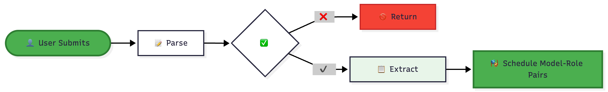
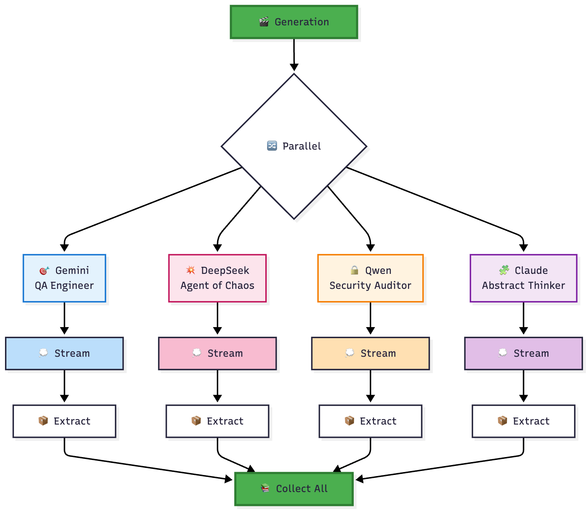
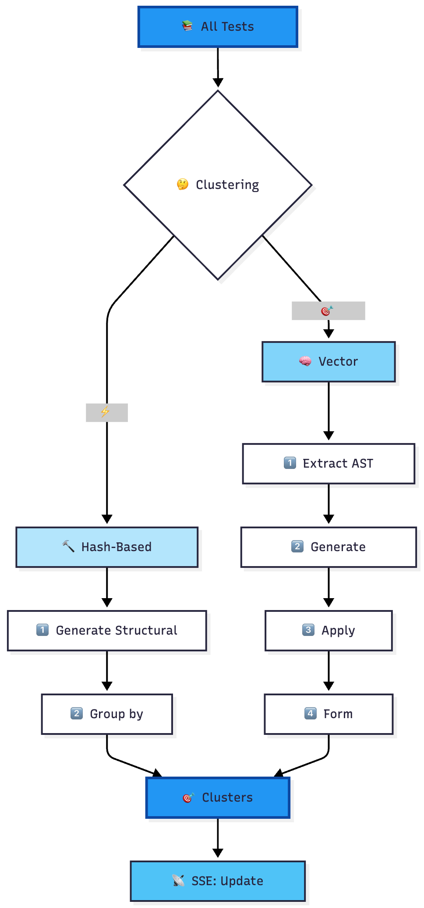
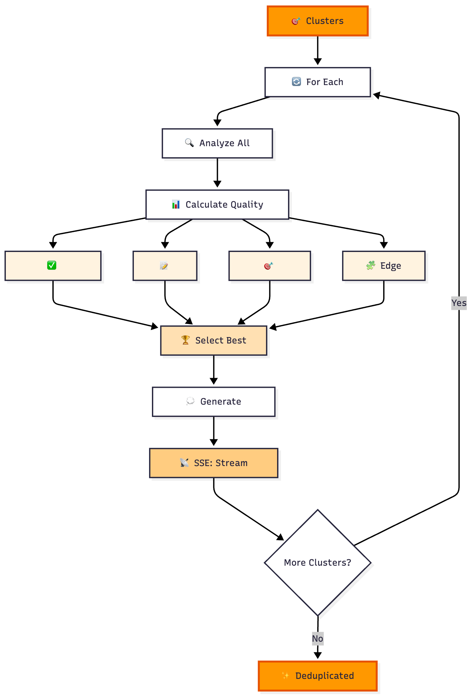
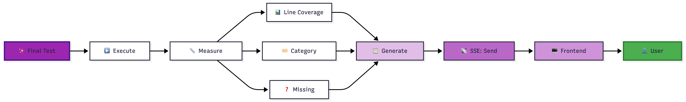

# 🧪 TestGen Council

**AI-Powered Test Generation with Multi-Model Consensus**

TestGen Council uses multiple AI models working in different testing roles to generate comprehensive, high-quality unit tests for your code. The system employs a unique "council" approach where models contribute diverse test cases, which are then clustered, deduplicated, and synthesized into a final test suite.

---

## 🌐 Live Demo

**Try it now at [testcouncil.com](https://testcouncil.com)** 🚀

Experience the power of multi-model AI test generation without any setup:

1. **Paste your code** in the editor
2. **Select AI models** (Gemini, DeepSeek, Qwen, Claude, etc.)
3. **Choose testing roles** (QA Engineer, Agent of Chaos, Security Auditor, Abstract Thinker)
4. **Watch in real-time** as tests are generated, clustered, and synthesized
5. **View coverage analysis** and download your test suite

> **Note:** The demo uses shared API resources. For production use or high-volume testing, consider deploying your own instance using the instructions below.

---

## 🎯 Overview

TestGen Council addresses the challenge of generating robust test suites by leveraging the strengths of multiple LLMs (Large Language Models), each adopting different testing philosophies. Instead of relying on a single model's perspective, the system creates a "council" of AI testers that collaborate to produce comprehensive test coverage.

### Key Features

- **Multi-Model Architecture**: Deploy multiple AI models (Gemini, DeepSeek, Qwen, etc.)
- **Role-Based Testing**: Each model assumes a specific testing philosophy:
  - 🎯 **By-the-Book QA Engineer**: Systematic, requirement-focused
  - 💥 **Agent of Chaos**: Adversarial, break-it-if-you-can approach
  - 🔒 **Paranoid Security Auditor**: Security-focused, assumes hostile input
  - 🧩 **Abstract Thinker**: Property-based, invariant testing
- **Intelligent Deduplication**: AST-based clustering to remove redundant tests
- **Real-Time Streaming**: Server-Sent Events (SSE) for live test generation feedback
- **Coverage Analysis**: Automatic test coverage calculation

---

## 🏗️ Architecture

### Backend (FastAPI)
- **Python 3.11+** with FastAPI framework
- **LiteLLM** for unified multi-provider LLM access
- **AST Analysis** for code parsing and test clustering
- **SSE Streaming** for real-time progress updates
- **Vector-based DBSCAN** or structural hashing for deduplication

### Frontend (React + Vite)
- **React 18** with hooks-based architecture
- **Context API** for global state management
- **SSE Client** for streaming test generation
- **Real-time UI Updates** showing thinking process and test generation
- **Responsive Design** with smooth animations

---

## 📊 Methodology: Test Generation Flow

The test generation pipeline consists of five main stages, each designed to maximize test quality through collaboration and intelligent deduplication.

---

### 🎯 Stage 1: Input & Validation



**What Happens:**
- Parse source code into Abstract Syntax Tree (AST)
- Validate syntax and structure
- Extract function signature, parameters, return type
- Create execution plan for all model-role combinations

---

### 🤖 Stage 2: Parallel LLM Generation



**What Happens:**
- All model-role pairs execute **simultaneously** (async)
- Each generates 5-10 tests from their unique perspective
- Real-time streaming via SSE shows thinking process
- Tests validated and extracted from responses

**SSE Events:** `llm_start` → `llm_chunk` → `llm_complete`

---

### 🔍 Stage 3: Intelligent Clustering



**What Happens:**

**Hash Method (O(n) - Fast):**
- Generate hash from AST structure + test type
- Instant grouping of identical tests

**Vector Method (Advanced):**
- Extract features: assertions, edge cases, patterns
- Generate semantic embeddings
- DBSCAN finds density-based clusters
- Groups similar (not just identical) tests

**Result:** Tests grouped by similarity

---

### 🧬 Stage 4: Synthesis & Deduplication



**What Happens:**
- For each cluster, analyze all candidate tests
- Score based on quality metrics
- Select single best representative
- Generate synthesis reasoning explaining choice
- Stream thinking process to frontend

**Result:** High-quality, non-redundant test suite

---

### 📈 Stage 5: Coverage Analysis



**What Happens:**
- Execute final test suite using `coverage.py`
- Calculate line coverage percentage
- Identify uncovered lines and branches
- Categorize coverage by test type
- Stream results to frontend in real-time

**SSE Events:** `coverage_start` → `coverage_complete` → `pipeline_complete`

---

### 🎬 Complete Pipeline Summary


**Timeline:** ~30-120 seconds depending on code complexity and number of models

---

## 🚀 Quick Start

### Prerequisites
- Python 3.11+
- Node.js 18+
- npm or yarn

### Backend Setup


# Clone repository
```bash
cd backend
```

# Create virtual environment
```bash
python -m venv venv
source venv/bin/activate  # On Windows: venv\Scripts\activate
```

# Install dependencies
```bash
pip install -r requirements.txt
```

# Configure environment
```bash
cp .env.example .env
```
# Edit .env with your LLM API keys

# Run backend
```bash
uvicorn main:app --host 0.0.0.0 --port 8000 --reload
```
### Frontend Setup

```bash
cd frontend
```
# Install dependencies
```bash
npm install
```

# Configure environment
```bash
cp src/.env.example .env.production
```
# Ensure VITE_API_BASE_URL=/api/v1

# Development
```bash
npm run dev
```
# Production build
```bash
npm run build
```
---

## 🔧 Configuration

### Backend Environment Variables

# LLM Provider API Keys
```bash
OPENAI_API_KEY=your_openai_key
```


# Server Configuration
```bash
CORS_ORIGINS=["http://localhost:3000", "https://yourdomain.com"]
MAX_TESTS_PER_MODEL=10
DEFAULT_CLUSTERING_METHOD=vector
```

# LLM Settings
```bash
LLM_TEMPERATURE=0.7
LLM_MAX_TOKENS=4000
```

### Frontend Environment Variables

# API Configuration (use relative path for production)
```bash
VITE_API_BASE_URL=/api/v1
```

# Optional: Request timeout
```bash
VITE_REQUEST_TIMEOUT=300000
```

---

## 📡 API Endpoints

### `GET /api/v1/health`
Health check endpoint

### `GET /api/v1/config`
Returns available models, roles, and clustering methods

### `POST /api/v1/generate-tests`
**Initiates test generation (SSE stream)**

**Request Body:**
```json
{
  "function_code": "def add(a, b): return a + b",
  "language": "python",
  "models": ["gemini-2.0-flash", "deepseek-chat"],
  "roles": ["qa_engineer", "agent_of_chaos"],
  "clustering_method": "vector",
  "max_tests_per_model": 10,
  "run_coverage": true
}
```

**SSE Events:**
- `pipeline_start`
- `llm_start`, `llm_chunk`, `llm_complete`
- `clustering_start`, `cluster_update`, `clustering_complete`
- `synthesis_start`, `synthesis_chunk`, `synthesis_complete`
- `coverage_start`, `coverage_complete`
- `pipeline_complete`

---

## 🎨 Frontend Architecture

### State Management (Context API)

javascript
AppContext
├── currentPhase (hero | input | generating | results)
├── input (code, language, models, roles)
├── generation (isGenerating, stage, progress)
├── modelOutputs (thinking, tests per model-role)
├── clusters (grouped tests)
└── synthesis (deduplicated tests, coverage)

### Key Hooks

- `useConfig()`: Fetches backend configuration
- `useTestGeneration()`: Orchestrates generation pipeline
- `useSSEStream()`: Handles Server-Sent Events

---

## 🛡️ Security Considerations

- **CORS**: Restricted to allowed origins
- **Input Validation**: AST-based validation before LLM processing
- **Rate Limiting**: Prevents API abuse
- **Timeout Protection**: Requests timeout after 5 minutes
- **SSL/TLS**: HTTPS enforced via CDN (ArvanCloud)

---

## 📈 Performance Optimizations

- **Parallel LLM Execution**: All model-role pairs run simultaneously
- **Streaming Responses**: SSE for real-time feedback without blocking
- **Fast Clustering Option**: Hash-based clustering for speed
- **Frontend Lazy Loading**: Code-split components for faster initial load
- **Nginx Caching**: Static assets cached at edge

---

## 🐛 Troubleshooting

### Backend won't start
# Check logs
```bash
journalctl -u testcouncil-backend.service -f
```

# Verify environment
```bash
python -c "from app.config import settings; print(settings.dict())"
```

### Frontend API calls fail
# Check nginx config
```bash
sudo nginx -t
```

# Verify API is accessible
```bash
curl http://localhost:8000/api/v1/health
```

# Check CORS settings in backend .env

### SSE connection drops
- Increase nginx `proxy_read_timeout` (default: 600s)
- Check firewall isn't blocking long-lived connections
- Verify `Connection: keep-alive` headers

---

## 📝 License

MIT License - See LICENSE file for details

---

## 🤝 Contributing

Contributions welcome! Please:
1. Fork the repository
2. Create a feature branch
3. Add tests for new functionality
4. Submit a pull request

---

## 📧 Support

For issues and questions:
- GitHub Issues: [Create an issue](https://https://github.com/sepehrvahedi/testgen-council/issues)
- Email: sepehr.vahedi@gmail.com

---

**Built with ❤️ using FastAPI, React, and the power of Multi-Model AI**
