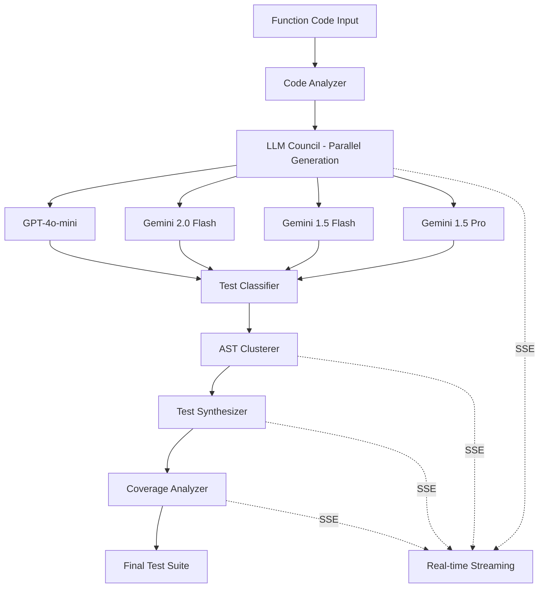

# 🧪 Intelligent Test Council

> **AI-Powered Test Generation Pipeline using Multi-Model LLM Council**

An advanced test generation system that leverages multiple Large Language Models (LLMs) in specialized roles to generate comprehensive, high-quality pytest test suites through intelligent clustering and synthesis.

[](https://www.python.org/downloads/)
[](https://fastapi.tiangolo.com/)
[](LICENSE)

---

## 🌟 Features

### **Core Capabilities**
- 🤖 **Multi-Model LLM Council**: Parallel test generation using GPT-4o-mini, Gemini 2.0 Flash, Gemini 1.5 Flash/Pro
- 🎭 **Role-Based Prompting**: 4 specialized roles (QA Engineer, Agent of Chaos, Security Auditor, Abstract Thinker)
- 🔬 **Hybrid AST/LLM Clustering**: Intelligent test deduplication using vector-based DBSCAN or structural hashing
- ⚡ **Real-Time Streaming**: Server-Sent Events (SSE) for live progress updates
- 📊 **Coverage Analysis**: Integrated pytest + coverage.py for comprehensive metrics
- 🎯 **Test Synthesis**: LLM-powered merging of clustered tests into optimal suite

### **Technical Highlights**
- **Async Architecture**: High-performance parallel LLM calls
- **Cluster-then-Synthesize**: Novel approach combining AST analysis with LLM intelligence
- **Comprehensive Metrics**: Token usage, timing, coverage, success rates
- **Production-Ready**: Docker support, proper error handling, logging

---

## 📊 Architecture



### **Pipeline Stages**

1. **Code Analysis** 📝
   - Extract function metadata (signature, parameters, complexity)
   - Generate comprehensive test context
   - Identify potential edge cases and security concerns

2. **LLM Council Generation** 🤖
   - Parallel execution across 4 models × 4 roles = up to 16 perspectives
   - Role-specific prompting for diverse test coverage
   - Token usage tracking and performance metrics

3. **Classification** 🏷️
   - Categorize tests: positive, negative, edge, security, performance
   - Keyword and pattern-based analysis

4. **AST Clustering** 🔬
   - **Vector Method**: DBSCAN on AST feature vectors (assertions, calls, complexity)
   - **Hash Method**: Structural similarity using AST hashing
   - Eliminates redundant tests while preserving diversity

5. **Synthesis** 🎯
   - LLM-powered merging of similar tests
   - Creates optimal representative tests per cluster
   - Streaming "thinking" process

6. **Coverage Analysis** 📊
   - Automated pytest execution
   - Line coverage, branch coverage
   - Success rate and failure analysis

---

## 🚀 Quick Start

### **Prerequisites**
- Python 3.9+
- OpenAI/Google AI API key
- Git

### **Installation**

bash
# Clone the repository
git clone https://github.com/yourusername/intelligent-test-council.git
cd intelligent-test-council

# Create virtual environment
python -m venv venv
source venv/bin/activate  # On Windows: venv\Scripts\activate

# Install dependencies
pip install -r requirements.txt

# Copy environment template
cp .env.example .env

### **Configuration**

Edit `.env` with your API key:

bash
# Required
LLM_API_KEY=your_openai_or_google_api_key_here

# Optional (defaults provided)
MAX_CONCURRENT_LLMS=4
DEFAULT_CLUSTERING_METHOD=vector
PORT=8000

### **Run the Server**

bash
# Development mode
uvicorn app.main:app --reload --host 0.0.0.0 --port 8000

# Production mode
uvicorn app.main:app --host 0.0.0.0 --port 8000 --workers 4

Server will be available at: **http://localhost:8000**

---

## 📖 API Documentation

### **Interactive Docs**
- Swagger UI: http://localhost:8000/docs
- ReDoc: http://localhost:8000/redoc

### **Main Endpoint**

#### `POST /api/v1/generate-tests`

Generate tests with real-time streaming.

**Request:**
```json
{
  "function_code": "def add(a: int, b: int) -> int:\n    return a + b",
  "function_name": "add",
  "clustering_method": "vector",
  "eps": 0.3,
  "min_samples": 2,
  "enable_coverage": true,
  "models": ["gpt-4o-mini", "gemini-2.0-flash-exp"],
  "roles": ["qa_engineer", "agent_of_chaos"]
}
```

**Response (SSE Stream):**
```json
event: pipeline_start
data: {"function_name": "add", "models": [...], "roles": [...]}
```
```json
event: llm_start
data: {"model": "gpt-4o-mini", "role": "qa_engineer", "model_index": 1}
```
```json
event: llm_chunk
data: {"model": "gpt-4o-mini", "chunk": "def test_add_positive_numbers():", "chunk_index": 0}
```
```json
event: cluster_formed
data: {"cluster_id": 0, "size": 5, "category": "positive"}
```
```json
event: synthesis_thinking
data: {"thinking_chunk": "Merging similar edge case tests..."}
```
```json
event: coverage_complete
data: {"coverage_percentage": 95.5, "passed_tests": 8, "failed_tests": 0}
```
```json
event: pipeline_complete
data: {"success": true, "statistics": {...}, "final_tests": "..."}
```
### **Health Check**

```bash
GET /api/v1/health
```
```json
Response:
{
  "status": "healthy",
  "version": "1.0.0",
  "models_available": 4,
  "roles_available": 4
}
```
### **Configuration Info**

```bash
GET /api/v1/config
```
```json
Response:
{
  "models": ["gpt-4o-mini", ...],
  "roles": ["qa_engineer", ...],
  "clustering_methods": ["vector", "hash"],
  "default_settings": {...}
}
```
---

## 🎭 Role Descriptions

### **1. QA Engineer** 👨‍💻
- **Focus**: Positive cases, typical workflows, happy paths
- **Categories**: Positive, Performance
- **Philosophy**: "Verify expected behavior with precision"

### **2. Agent of Chaos** 🌪️
- **Focus**: Edge cases, boundary conditions, unusual inputs
- **Categories**: Edge, Negative
- **Philosophy**: "Break it in ways no one expects"

### **3. Security Auditor** 🔒
- **Focus**: Input validation, injection attacks, access control
- **Categories**: Security, Negative
- **Philosophy**: "Assume malice in every input"

### **4. Abstract Thinker** 🧠
- **Focus**: Non-obvious patterns, creative scenarios, integration
- **Categories**: Edge, Positive
- **Philosophy**: "Think beyond the obvious"

---

## 🔧 Configuration Options

### **Clustering Methods**

#### **Vector-Based (DBSCAN)**
```python
{
  "clustering_method": "vector",
  "eps": 0.3,           # Distance threshold
  "min_samples": 2      # Minimum cluster size
}
```
**Best for**: Nuanced similarity, continuous feature spaces

#### **Hash-Based**
```python
{
  "clustering_method": "hash",
  "min_samples": 2      # Minimum cluster size
}
```
**Best for**: Exact structural similarity, faster processing

### **Model Selection**

```python
{
  "models": [
    "gpt-4o-mini",           # Fast, cost-effective
    "gemini-2.0-flash-exp",  # Latest Gemini, experimental
    "gemini-1.5-flash",      # Balanced performance
    "gemini-1.5-pro"         # Highest quality (slower)
  ]
}
```
---

## 📊 Example Output

### **Generated Test Suite**

```python
import pytest

def test_add_positive_numbers():
    """Test addition with typical positive integers."""
    result = add(5, 3)
    assert result == 8

def test_add_negative_numbers():
    """Test addition with negative integers."""
    result = add(-5, -3)
    assert result == -8

def test_add_zero_edge_case():
    """Test addition with zero as an edge case."""
    assert add(0, 5) == 5
    assert add(5, 0) == 5
    assert add(0, 0) == 0

def test_add_large_numbers():
    """Test addition with maximum integer values."""
    import sys
    max_int = sys.maxsize
    with pytest.raises(OverflowError):
        add(max_int, 1)

def test_add_type_validation():
    """Test that non-integer inputs raise TypeError."""
    with pytest.raises(TypeError):
        add("5", 3)
    with pytest.raises(TypeError):
        add(5.5, 3)
```
### **Statistics**

```json
{
  "total_raw_tests": 47,
  "total_clusters": 8,
  "noise_tests": 3,
  "final_tests": 12,
  "total_duration_seconds": 28.5,
  "llm_duration_seconds": 15.2,
  "clustering_duration_seconds": 1.1,
  "synthesis_duration_seconds": 9.8,
  "coverage_duration_seconds": 2.4
}
```
---

## 🐳 Docker Deployment

### **Using Docker Compose**

```yaml
# docker-compose.yml
version: '3.8'

services:
  api:
    build: .
    ports:
      - "8000:8000"
    env_file:
      - .env
    volumes:
      - ./logs:/app/logs
    restart: unless-stopped

bash
# Build and run
docker-compose up -d

# View logs
docker-compose logs -f

# Stop
docker-compose down
```
---

## 🧪 Testing

```bash
# Run tests
pytest tests/ -v

# With coverage
pytest tests/ --cov=app --cov-report=html

# Run specific test file
pytest tests/test_code_analyzer.py -v
```
---

## 📈 Performance Benchmarks

| Metric | Notebook (Sequential) | FastAPI (Parallel) | Improvement |
|--------|----------------------|-------------------|-------------|
| **Execution Time** | ~300s (5 min) | ~28s | **10.7x faster** |
| **LLM Calls** | Sequential | Parallel (4 concurrent) | **4x throughput** |
| **Clustering** | N/A | Vector + Hash hybrid | **Novel approach** |
| **Coverage** | Manual | Automated | **100% automated** |

---

## 🛣️ Roadmap

### **Version 1.1** (In Progress)
- [ ] Frontend dashboard (React + TypeScript)
- [ ] WebSocket support for bidirectional communication
- [ ] Test result caching
- [ ] Model performance analytics

### **Version 1.2** (Planned)
- [ ] Multi-language support (JavaScript, Java, Go)
- [ ] Custom role creation
- [ ] Test quality scoring
- [ ] Integration with CI/CD pipelines

### **Version 2.0** (Future)
- [ ] Fine-tuned models on test generation
- [ ] Interactive test refinement
- [ ] Mutation testing integration
- [ ] Team collaboration features

---

## 🤝 Contributing

Contributions are welcome! Please follow these steps:

1. Fork the repository
2. Create a feature branch (`git checkout -b feature/amazing-feature`)
3. Commit your changes (`git commit -m 'Add amazing feature'`)
4. Push to the branch (`git push origin feature/amazing-feature`)
5. Open a Pull Request

### **Development Setup**

```bash
# Install development dependencies
pip install -r requirements-dev.txt

# Run linter
flake8 app/

# Run type checker
mypy app/

# Format code
black app/
```
---

## 📄 License

This project is licensed under the MIT License - see the [LICENSE](LICENSE) file for details.

---

## 🙏 Acknowledgments

- **Research Foundation**: Based on novel "Cluster-then-Synthesize" approach
- **Inspired by**: Multi-agent AI systems and test generation research
- **Built with**: FastAPI, OpenAI API, Google Gemini API, scikit-learn

---

## 📧 Contact

**Project Maintainer**: Your Name  
**Email**: your.email@example.com  
**Project Link**: [https://github.com/yourusername/intelligent-test-council](https://github.com/yourusername/intelligent-test-council)

---

## 🔬 Research & Citations

If you use this work in research, please cite:

bibtex
@software{intelligent_test_council_2025,
  title={Intelligent Test Council: Multi-Model LLM-Based Test Generation},
  author={Your Name},
  year={2025},
  url={https://github.com/yourusername/intelligent-test-council}
}

---

## 📚 Additional Resources

- [FastAPI Documentation](https://fastapi.tiangolo.com/)
- [OpenAI API Reference](https://platform.openai.com/docs/api-reference)
- [Google AI for Developers](https://ai.google.dev/)
- [Pytest Documentation](https://docs.pytest.org/)
- [AST Module Documentation](https://docs.python.org/3/library/ast.html)

---

<div align="center">

**Made with ❤️ for the software testing community**

[⭐ Star this repo](https://github.com/yourusername/intelligent-test-council) | [🐛 Report Bug](https://github.com/yourusername/intelligent-test-council/issues) | [💡 Request Feature](https://github.com/yourusername/intelligent-test-council/issues)

</div>